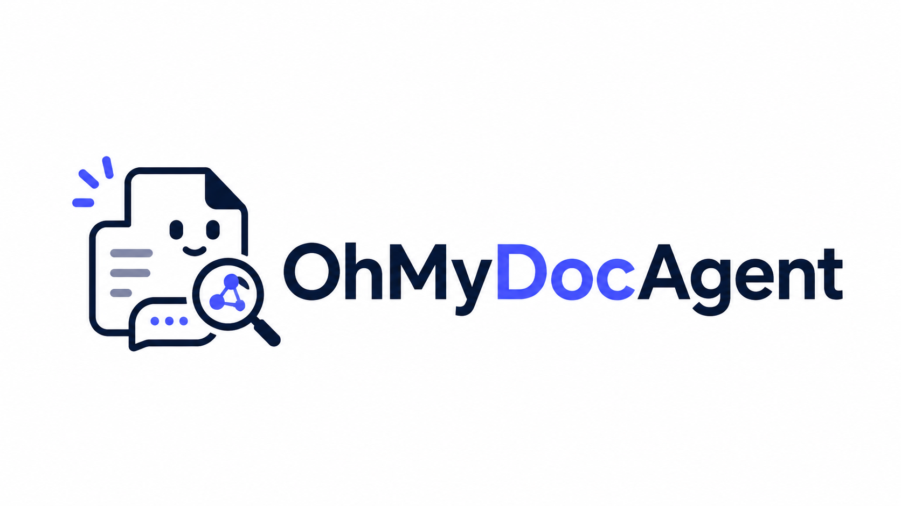

<div align="center">
  

  <p><strong>把散落在团队文档里的知识，整理成随时可问、可溯源、可推理的企业 AI 知识库。</strong></p>

  <p>
    <a href="#-核心能力">核心能力</a> ·
    <a href="#-工作原理">工作原理</a> ·
    <a href="#-快速开始">快速开始</a> ·
    <a href="#-项目结构">项目结构</a> ·
    <a href="#-开源协议">开源协议</a>
  </p>

  <p>
    
    
    
    
    
    
    <a href="./LICENSE"></a>
  </p>
</div>


OhMyDocAgent 是一个面向企业团队的 AI 知识工作台：上传 PDF / Word / 图片文档，平台完成版面解析、分块、双路索引与知识图谱抽取，回答问题时既给出带引用来源的答案，也能跨文档推理实体关系。所有回答都可回溯到原文段落与图表。


<h2 align="center">
  <a href="http://ohmydocagent.xyz">👉直接访问已部署网站👈</a>
</h2>


## ✨ 核心能力

- 📄 **多模态文档解析**：MinerU 版面解析管线（版面检测 / 阅读顺序 / 表格识别 / 图表提取），图片内容经 VLM 批量语义描述（多图一次请求、token 感知自动分批并发），图表生成独立检索单元。
- 🔍 **中文检索管线**：应用侧中文分词建立词粒度关键词索引（解决数据库默认分词不切中文），向量 + 关键词双路召回、RRF 融合、重排精排；检索 TopK 由模型动态控制。
- 🕸️ **语义检索与图谱解耦**：语义检索（文本召回 + 引用）与知识图谱检索（实体关系 / 跨文档多跳）两个独立工具，系统提示编排固定工作流——文本检索结果不再被图谱噪声污染。
- 📎 **可溯源问答**：回答标注引用 `[n]`，引用携带文档位置 / 页码 / 图片缩略图，一键跳转原文对应段落。
- 🧩 **知识图谱**：抽取文档实体与关系入库 Neo4j，支持"X 与 Y 是什么关系"、跨文档实体关联类问题。
- 🔐 **企业级工程**：多租户模型配置（对话 / 向量 / 重排按用户私有）、异步任务队列、文档级与知识库级分块策略、RBAC + 知识库共享权限。

## ⚙️ 工作原理

```
上传文档 → MinerU 版面解析（文本 / 表格 / 图片）
        → 图片走 VLM 批量描述（describe_many：一次请求多图、按 [1]..[N] 编号输出）
        → 分块（词粒度中文分词 + 语义向量双路索引）
        → 知识图谱抽取（实体 / 关系 → Neo4j）
        → 问答：Agent 先语义检索（search_kb）→ 需要实体关系时查图谱（search_graph）
        → 生成带引用 [n] 的回答（引用可带图、可跳转原文）
```

## 🚀 本地部署


### 环境要求

- Node.js 20+、Python 3.11
- Docker（PostgreSQL + Redis + Neo4j + MinIO）

### 本地启动

```bash
# 1. 启动基础设施（PostgreSQL / Redis / Neo4j / MinIO）
cd deploy
docker compose up -d

# 2. 安装依赖（monorepo，仓库根目录）
cd .. && npm install

# 3. 启动后端与前端
npm run dev:backend   # NestJS API，默认 http://127.0.0.1:3000
npm run dev:frontend  # React 前端，默认 http://127.0.0.1:5173
```

### 配置模型

首次使用在「设置 → 模型管理」中配置对话 / 向量 / 重排模型（OpenAI 兼容服务均可）。模型 API Key 由平台加密存储，按用户隔离。

### 文档解析服务（可选）

真实版面解析需要启动独立的 Python 解析服务（`parser/`）——MinerU 版面解析 + VLM 图片描述，后端经 gRPC 对接：

```bash
cd parser
docker build -t ohmydocagent/parser -f Dockerfile .
# compose 中设置 PARSER_URL=parser:50051 启用
```

## 📁 项目结构

```text
backend/    NestJS 后端（REST + SSE 流式对话 + 异步任务队列）
frontend/   React 前端（知识库管理 + 对话界面）
parser/     Python 解析服务（MinerU 版面解析 + VLM 图片描述）
deploy/     基础设施编排（PostgreSQL / Redis / Neo4j / MinIO）
assets/     仓库图片
```

## 📄 开源协议

OhMyDocAgent 使用 [MIT License](./LICENSE) 开源。
